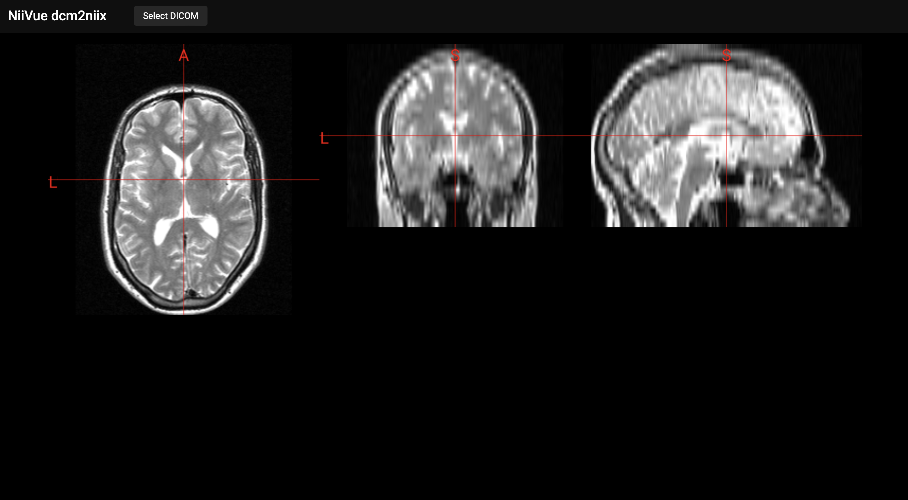

# NiiVue + dcm2niix

This project is an integration of the asm.js port of [dcm2niix](https://github.com/rordenlab/dcm2niix) into [NiiVue](https://github.com/niivue/niivue).

## Build

This examples uses [Vite](https://vitejs.dev) 
To run:
`npm run dev`

## Usage

Try the demo [here](https://softwiredtech.github.io/niivue-dcm2niix/)! 

To select DICOM slices, click on "Select DICOM", then from the file selection window select all the slices you want to convert to NIfTI. After the selection, the converted NIfTI volume will be loaded into NiiVue and rendered on the screen.

## License

BSD 2-Clause License
